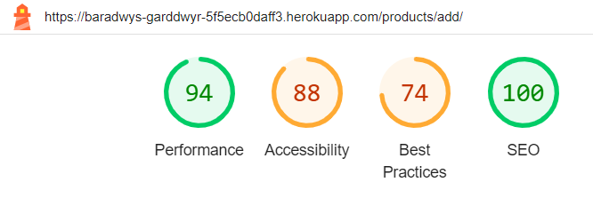
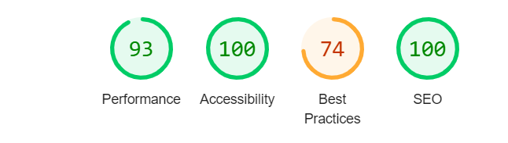

# Baradwys Garddwyr E-Commerce Website

(by Morgan Jenkins)

[Live Project]

## Table of Contents

- [Baradwys Garddwyr E-Commerce Website](#baradwys-garddwyr-e-commerce-website)
  - [Table of Contents](#table-of-contents)
  - [Project Goals](#project-goals)
    - [User Goals](#user-goals)
    - [Site Owner Goals](#site-owner-goals)
  - [User Experience](#user-experience)
    - [Target Audience](#target-audience)
    - [User Requirements and Expectations](#user-requirements-and-expectations)
    - [User Stories](#user-stories)
      - [First-time User](#first-time-user)
      - [Returning User](#returning-user)
      - [Site Owner](#site-owner)
  - [Scope](#scope)
  - [Design of Site](#design-of-site)
    - [Initial idea](#initial-idea)
    - [Wireframes](#wireframes)
    - [Site Layout](#site-layout)
    - [User Path](#user-path)
    - [Database Structure](#database-structure)
    - [Colour Choices](#colour-choices)
    - [Fonts](#fonts)
  - [Technologies Implemented](#technologies-implemented)
    - [Languages](#languages)
    - [Tools](#tools)
  - [Site Features](#site-features)
  - [Testing](#testing)
    - [Validation](#validation)
      - [HTML Validation- W3C markup validation service was used to assess the validity of my HTML code](#html-validation--w3c-markup-validation-service-was-used-to-assess-the-validity-of-my-html-code)
      - [CSS Validation- W3C CSS validation service was used to assess the validity of my CSS code](#css-validation--w3c-css-validation-service-was-used-to-assess-the-validity-of-my-css-code)
      - [JavaScript Validation- JS hint was used to assess the validity of my scripts](#javascript-validation--js-hint-was-used-to-assess-the-validity-of-my-scripts)
      - [Python Validation- The CI python linter was used to assess the the validity of my python file](#python-validation--the-ci-python-linter-was-used-to-assess-the-the-validity-of-my-python-file)
    - [Performance and Accessibility](#performance-and-accessibility)
    - [Device Tests](#device-tests)
    - [Responsiveness](#responsiveness)
    - [User Story Tests](#user-story-tests)
    - [First Time User](#first-time-user-1)
    - [Returning User](#returning-user-1)
    - [Site Owner](#site-owner-1)
  - [Bug Squashing](#bug-squashing)
  - [Deployment](#deployment)
    - [Project Creation](#project-creation)
    - [Deployment to Heroku](#deployment-to-heroku)
  - [Credits](#credits)
  - [Thank You](#thank-you)

## Project Goals

### User Goals
* To see all products for sale in the store.
* To read articles about gardening on the site.
* To select items and put them in a shopping bag.
* To read details about the products for sale.
* To leave reviews for products and articles.
* To read reviews for products and articles.
* To checkout and purchase items in my shopping bag.

### Site Owner Goals 
* To allow users to make purchases on the site.
* To manage admin on products and articles.

## User Experience

### Target Audience

The target audience for this site is for both new and intermediate gardeners. It is for those that wish to buy supplies for gardening and read helpful articles to improve their skills.

### User Requirements and Expectations

* Easy to navigate site and intuitive design.
* Nice design which functions well on both desktop and mobile devices. 
* All links to be fully functional.
* Able to view all products for sale.
* Able to sort products by category.
* Able to sort products by different factors (e.g. price, name, etc.)
* Able to leave and read product reviews.
* Able to login and make purchases.
* Able to view and read all articles on the site.
* Able to sort articles by different factors (e.g. name, rating etc.)
* Able to leave and read article reviews.
* Able to use a search function to find products.

### User Stories

|**User Story**|**User Type**|**A user would want to**|**because**|
|--------------|-------------|------------------------|-----------|
|*1*|*Shopper*|*View all products*|*Decide which product they want to buy*|
|*2*|*Shopper*|*See product details*|*See specific details about the products such as a description, planting conditions, reviews, price, etc.*|
|*3*|*Shopper*|*Sort products on the product page*|*To better search the product page according to their prefernec be that finding a specific product or finding the cheapest item*|
|*4*|*Shopper*|*Place items in a shopping bag*|*To be able to purchase multiple items at once and edit what items they want when it comes time to purchase*|
|*5*|*Shopper*|*Purchase items from their shopping bag*|*Complete purchase process and pay for items they want*|
|*6*|*Shopper*|*View an order history*|*Review previous purchases*|
|*7*|*Shopper*|*Search site for specific items*|*Find a specific product*|
|*8*|*Shopper*|*Create reviews for products*|*Leave user impressions on product or purchase process*|
|*9*|*Shopper*|*View reviews for products*|*To see others impressions on product to inform purchase*|
|*10*|*Shopper*|*Receive email confirmation of a purchase*|*To confirm that the purchase was susccessful and to get a summary of what was purchased*|
|*11*|*Shopper*|*Update profile details*|*To create a distinct profile and update default delivery address*|
|*12*|*Shopper*|*Create an account for the site*|*To provide default information to speed up purchase process*|
|*13*|*Shopper*|*Sign in and out of their account*|*Access personal information stored on the site*|
|*14*|*Shopper*|*View articles on the site*|*To read helpful information that the site provides related to the site goals (gardening)*|
|*15*|*Shopper*|*Leave reviews for articles*|*Comment on articles information *|
|*16*|*Site Admin*|*Add products*|*Include new products that have come into stock for sale*|
|*17*|*Site Admin*|*Delete products*|*Remove discontinued products from the store*|
|*18*|*Site Admin*|*Edit Products*|*Change details for the products already on the store*|
|*19*|*Site Admin*|*Add Articles*|*Create new articles for the website*|
|*20*|*Site Admin*|*Delete Articles*|*Remove old articles from the website*|
|*21*|*Site Admin*|*Edit Articles*|*Change details for the articles in the website*|

## Scope

The scope of the project in it’s first release is defined by the following features:

* An easy to navigate site where all important features can be accessed through clear and discernable links, no need for back and forward buttons.
* Users should be able to log into an account with default details for shipping and make purchases, they can also read helpful articles. Site admins can log in to an admin account and perform CRUD applications on articles and products.
* All users can view reviews on products and articles.
* All users can sort products and search for them.
* Clear logo which is also used as a favicon.
* Error pages which direct a user back to the home page when a problem occurs.

## Design of Site

The design of the site was inspired by BBC's Gardeners World. This was so it would have interesting articles to help newbie and intermediate gardeners. It would also have appropriate products attached. Full Disclosure: The articles and products for the site were generated using ChatGPT to save time however all code was my own creation adapted from the CodeInstitute Boutique Ado Project.

### Initial idea

The initial idea for this project was to create a gardening resource site. This was to have helpful gardening articles and useful products related to gardening that could be purchased.

### Wireframes

To create the wireframes for this site I used the balsamiq cloud service. This allowed me to create a more basic wireframe. This was helpful as I have found in the past having a more complex and detailed wireframe to be quite restricting.

Home Page

 

Products Page

 

Product Details Page

 

Product Admin Page

 

Articles Page

 

Article Details Page

 

Article Admin Page

 

Registration Page

 

Sign-In Page

 

Profile Page

 

Bag Page

 

Checkout Page

 

### Site Layout

### User Path

I used Figma to show a prospective users path through the Baradwys Garddwyr website.

### Database Structure

I used LucidChart to create the ERD showing how the data would flow and be stored in ElephantSQL.

### Colour Choices

The colour choices were made to emulate BBC Gardeners world lightly with a verdant and fresh feel evocative of gardens.

### Fonts

The font choice for this site is Playfair Display with serif as a backup, I chose this font as I beleive it is a clear and easily legible font perfect for a site with articles.

## Technologies Implemented

### Languages

* HTML
* CSS
* JavaScript
* Python

### Tools

* Django - Used to develop the backend infrastructure
* AWS - Created an S3 bucket to store static files for deployment.
* Bootstrap - Used styling features and grid system to keep site responsive.
* ElephantSQL - Used to store the PostGreSQL databse used by Django.
* Stripe - Used to handle the payments for the site and webhooks sent back from  Stripe.
* Git - Used to add and commit changes to my local repo and then push to remote branch.
* GitHub - Used to store source code and repo of the site.
* Balsamiq - Used to create basic wireframes for the site.
* Lucid - Used to create ERD for the database structure of the site.
* Google Fonts - Used for the fonts utilised on the site.
* Font Awesome - Used to generate icons on the site.
* Favicon.io - Used to create Favicon and Logo for site.

## Site Features

## Testing

### Validation

#### HTML Validation- W3C markup validation service was used to assess the validity of my HTML code, for some results you may need to be logged into a admin or user account.
index.html (Home page) - [Results](https://validator.w3.org/nu/?doc=https%3A%2F%2Fbaradwys-garddwyr-5f5ecb0daff3.herokuapp.com%2F) 

articles.html - [Results](https://validator.w3.org/nu/?doc=https%3A%2F%2Fbaradwys-garddwyr-5f5ecb0daff3.herokuapp.com%2Farticles) 

add_article.html - [Results](https://validator.w3.org/nu/?doc=https%3A%2F%2Fbaradwys-garddwyr-5f5ecb0daff3.herokuapp.com%2Farticles%2Fadd%2F) 

edit_article.html - [Results](https://validator.w3.org/nu/?doc=https%3A%2F%2Fbaradwys-garddwyr-5f5ecb0daff3.herokuapp.com%2Farticles%2Fedit%2F1%2F) 

products.html - [Results](https://validator.w3.org/nu/?doc=https%3A%2F%2Fbaradwys-garddwyr-5f5ecb0daff3.herokuapp.com%2Fproducts%2F) 

add_product.html - [Results](https://validator.w3.org/nu/?doc=https%3A%2F%2Fbaradwys-garddwyr-5f5ecb0daff3.herokuapp.com%2Fproducts%2Fadd) 

edit_product.html - [Results](https://validator.w3.org/nu/?doc=https%3A%2F%2Fbaradwys-garddwyr-5f5ecb0daff3.herokuapp.com%2Fproducts%2Fedit%2F5%2F) 

product_details.html - [Results](https://validator.w3.org/nu/?doc=https%3A%2F%2Fbaradwys-garddwyr-5f5ecb0daff3.herokuapp.com%2Fproducts%2F5%2F) 

profile.html - [Results](https://validator.w3.org/nu/?doc=https%3A%2F%2Fbaradwys-garddwyr-5f5ecb0daff3.herokuapp.com%2Fprofile) 

bag.html - [Results](https://validator.w3.org/nu/?doc=https%3A%2F%2Fbaradwys-garddwyr-5f5ecb0daff3.herokuapp.com%2Fbag%2F) 

checkout.html - [Results](https://validator.w3.org/nu/?doc=https%3A%2F%2Fbaradwys-garddwyr-5f5ecb0daff3.herokuapp.com%2Fcheckout%2F) 

checkout_success.html - [Results](https://validator.w3.org/nu/?doc=https%3A%2F%2Fbaradwys-garddwyr-5f5ecb0daff3.herokuapp.com%2Fprofile%2Forder_history%2FF39DD59C693247EE9EDDCF904C45A98D) 

For checkout success validation update the order number in the address with one that you have used.

404.html - [Results](https://validator.w3.org/nu/?checkerrorpages=yes&useragent=Validator.nu%2FLV+https%3A%2F%2Fvalidator.w3.org%2Fservices&acceptlanguage=&doc=https%3A%2F%2Fbaradwys-garddwyr-5f5ecb0daff3.herokuapp.com%2F404) 

403.html - [Results](https://validator.w3.org/nu/?checkerrorpages=yes&useragent=Validator.nu%2FLV+https%3A%2F%2Fvalidator.w3.org%2Fservices&acceptlanguage=&doc=https%3A%2F%2Fbaradwys-garddwyr-5f5ecb0daff3.herokuapp.com%2F403) 

500.html - [Results](https://validator.w3.org/nu/?checkerrorpages=yes&useragent=Validator.nu%2FLV+https%3A%2F%2Fvalidator.w3.org%2Fservices&acceptlanguage=&doc=https%3A%2F%2Fbaradwys-garddwyr-5f5ecb0daff3.herokuapp.com%2F500) 

For the above error pages ensure that the error pages option is checked in the html checker options.

#### CSS Validation- W3C CSS validation service was used to assess the validity of my CSS code

The below results show no errors in the css code, there are several warnings although these are related to the webkit extensions.

Whole Site CSS - [Results](https://jigsaw.w3.org/css-validator/validator?uri=https%3A%2F%2Fbaradwys-garddwyr-5f5ecb0daff3.herokuapp.com%2F&profile=css3svg&usermedium=all&warning=1&vextwarning=&lang=en)

#### JavaScript Validation- JS hint was used to assess the validity of my scripts

All Javascript code passed with a few warning relateds to javascript versioning e.g. only available in ES6

#### Python Validation- 
The CI python linter was used to assess the the validity of my python file whilst development of the site was underway and in progress. Upon project completion the command 'python3 -m flake8' was used to check for formatting and other issues.

`gitpod /workspace/MSP4_Baradwys_Garddwyr (main) $ python3 -m flake8
./.devcontainer/build-assets/http_server.py:22:80: E501 line too long (80 > 79 characters)
./.devcontainer/build-assets/make_url.py:10:39: E231 missing whitespace after ','
./.devcontainer/build-assets/make_url.py:11:36: E231 missing whitespace after ','
./.devcontainer/build-assets/make_url.py:12:39: E231 missing whitespace after ','
./.devcontainer/build-assets/make_url.py:14:59: W292 no newline at end of file
./articles/migrations/0001_initial.py:17:80: E501 line too long (117 > 79 characters)
./articles/migrations/0001_initial.py:21:80: E501 line too long (103 > 79 characters)
./articles/migrations/0001_initial.py:22:80: E501 line too long (82 > 79 characters)
./articles/migrations/0003_articlereview.py:19:80: E501 line too long (117 > 79 characters)
./articles/migrations/0003_articlereview.py:23:80: E501 line too long (147 > 79 characters)
./articles/migrations/0003_articlereview.py:24:80: E501 line too long (156 > 79 characters)
./baradwys_garddwyr/settings.py:142:80: E501 line too long (91 > 79 characters)
./baradwys_garddwyr/settings.py:145:80: E501 line too long (81 > 79 characters)
./baradwys_garddwyr/settings.py:148:80: E501 line too long (82 > 79 characters)
./baradwys_garddwyr/settings.py:151:80: E501 line too long (83 > 79 characters)
./checkout/apps.py:8:9: F401 'checkout.signals' imported but unused
./checkout/migrations/0001_initial.py:19:80: E501 line too long (117 > 79 characters)
./checkout/migrations/0001_initial.py:20:80: E501 line too long (82 > 79 characters)
./checkout/migrations/0001_initial.py:25:80: E501 line too long (85 > 79 characters)
./checkout/migrations/0001_initial.py:28:80: E501 line too long (92 > 79 characters)
./checkout/migrations/0001_initial.py:29:80: E501 line too long (83 > 79 characters)
./checkout/migrations/0001_initial.py:31:80: E501 line too long (98 > 79 characters)
./checkout/migrations/0001_initial.py:32:80: E501 line too long (97 > 79 characters)
./checkout/migrations/0001_initial.py:33:80: E501 line too long (97 > 79 characters)
./checkout/migrations/0001_initial.py:39:80: E501 line too long (117 > 79 characters)
./checkout/migrations/0001_initial.py:41:80: E501 line too long (104 > 79 characters)
./checkout/migrations/0001_initial.py:42:80: E501 line too long (137 > 79 characters)
./checkout/migrations/0001_initial.py:43:80: E501 line too long (115 > 79 characters)
./checkout/migrations/0004_order_user_profile.py:18:80: E501 line too long (155 > 79 characters)
./products/migrations/0001_initial.py:18:80: E501 line too long (117 > 79 characters)
./products/migrations/0001_initial.py:20:80: E501 line too long (91 > 79 characters)
./products/migrations/0001_initial.py:29:80: E501 line too long (117 > 79 characters)
./products/migrations/0001_initial.py:35:80: E501 line too long (103 > 79 characters)
./products/migrations/0001_initial.py:36:80: E501 line too long (89 > 79 characters)
./products/migrations/0001_initial.py:37:80: E501 line too long (82 > 79 characters)
./products/migrations/0001_initial.py:38:80: E501 line too long (141 > 79 characters)
./products/migrations/0002_alter_product_category.py:17:80: E501 line too long (141 > 79 characters)
./products/migrations/0003_review.py:18:80: E501 line too long (117 > 79 characters)
./products/migrations/0003_review.py:22:80: E501 line too long (146 > 79 characters)
./products/migrations/0003_review.py:23:80: E501 line too long (139 > 79 characters)
./products/migrations/0004_alter_review_created_by.py:19:80: E501 line too long (134 > 79 characters)
./products/widgets.py:9:80: E501 line too long (87 > 79 characters)
./profiles/migrations/0001_initial.py:21:80: E501 line too long (117 > 79 characters)
./profiles/migrations/0001_initial.py:22:80: E501 line too long (97 > 79 characters)
./profiles/migrations/0001_initial.py:23:80: E501 line too long (111 > 79 characters)
./profiles/migrations/0001_initial.py:24:80: E501 line too long (93 > 79 characters)
./profiles/migrations/0001_initial.py:25:80: E501 line too long (97 > 79 characters)
./profiles/migrations/0001_initial.py:26:80: E501 line too long (100 > 79 characters)
./profiles/migrations/0001_initial.py:27:80: E501 line too long (100 > 79 characters)
./profiles/migrations/0001_initial.py:28:80: E501 line too long (91 > 79 characters)
./profiles/migrations/0001_initial.py:29:80: E501 line too long (121 > 79 characters)` 

As can be seen above most issues raised are caused by lengthy migrations and the local env.

### Performance and Accessibility

Performance and accessibility were tested using google dev tools lighthouse feature.

Below are the results from these tests.

Home Page

 

Products Page

 

Product Details Page

 

Add Product Page

 

Edit Product Page

 

Articles Page

 

Add Article Page

 

Edit Article Page

 

Log In Page

 

Register Page

 

Profile Page

 

Bag Page

 

Checkout Page

 

On analysis of the test many of the lower performance scores were caused by issues rendering high quality images or the images being scaled out of their original aspect ratio to fit withing the cards as displayed on the site.

Lower accessibility scores were caused by contrast errors.

### Device Tests

The website was tested on the following devices:

* Samsung Galaxy M31
* iPhone 12 Pro
* Ipad Pro 4th Gen
* Asus Vivobook laptop (X515JAB_X515JA)

### Responsiveness

Responsiveness was tested using googles developer tools to test different devices and orientations.

Tests showed that the site was fully responsive to desktop, tablet and mobile.
### User Story Tests

### First Time User

### Returning User

### Site Owner

## Bug Squashing

| **Bug** | **Fix** |
|---------|---------|

## Deployment

### Project Creation

### Deployment to Heroku

## Credits

* Images for the site were acquired from [Pexels](https://www.pexels.com/)
* Majority of python code was adapted from the walkthorugh project (Task Manager).
* [Materialize](https://materializecss.com/) was used as the framework for this site aiding in components and responsiveness.

## Thank You

* My mentor Antonio Rodriguez for his help and advice in creating this project.
* To the team at [Code Institute](https://codeinstitute.net/) for the lessons and support.
* My Partner for helping with project testing and supporting me through it.
